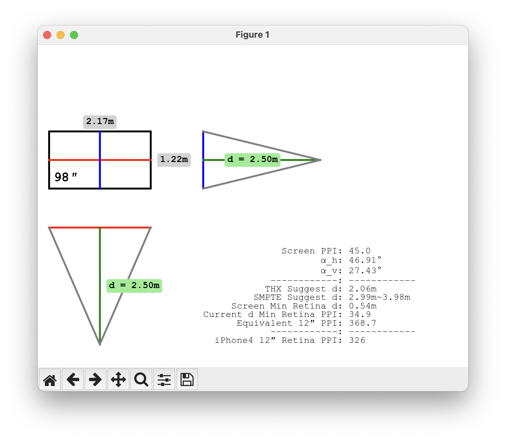

# PythonPlayground

|  #  | Project                                             | Description                           | Preview                                                                                                                                                                                            |
| :-: |-----------------------------------------------------|---------------------------------------|----------------------------------------------------------------------------------------------------------------------------------------------------------------------------------------------------|
| 01  | [screen_retina_distance](screen_retina_distance.py) | 通过可视化展示视角等参数，帮助评估可购买的最大电视的尺寸以及最佳观看距离  | 屏幕尺寸 85″，观看距离 2.5m      屏幕尺寸 98″，观看距离 2.5m    |
